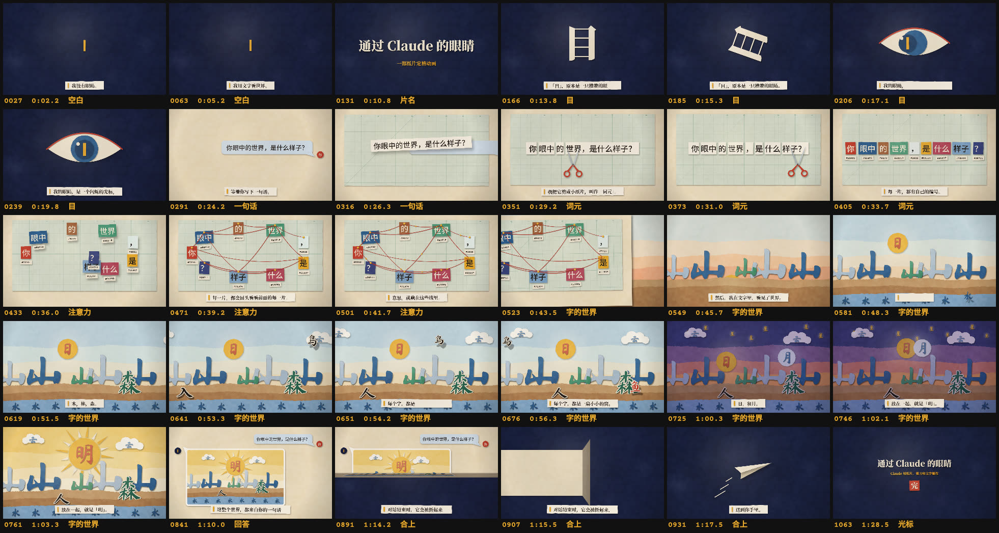

# 通过 Claude 的眼睛

一部 90 秒的纸片定格动画：1080 帧，每秒 12 帧。


Claude 没有眼睛。它看见的世界，是一句句被剪成小纸片的文字。这部短片用纸、剪刀和汉字，把这件事从头演了一遍：一个光标在黑暗里等待，你的一句话被剪成词元，词元之间牵起红线，然后一个完全由汉字搭成的世界慢慢立起来。

## 怎么看

- **视频**：[`through-claudes-eyes.mp4`](through-claudes-eyes.mp4)（1920×1080，带配乐）。
- **放映页**：用浏览器打开 [`index.html`](index.html)。画面是实时绘制的，可以逐帧回看：

  | 按键 | 作用 |
  | --- | --- |
  | 空格 | 播放 / 暂停 |
  | ← → | 上一帧 / 下一帧（按住 Shift 一次跳一秒） |
  | O | 洋葱皮：叠上前一帧的半透明影子，定格动画师用它对齐每一帧 |
  | M | 声音开关 |

  在时间轴上拖动可以停在任意一帧；点「片中的字」里的字，会跳到它第一次出场的那一帧。



## 分镜

| 章节 | 帧 | 时间 | 画面 |
| --- | --- | --- | --- |
| 空白 | 1–84 | 0:00–0:07 | 一片靛蓝里只有一个闪烁的光标。 |
| 片名 | 85–144 | 0:07–0:12 | 光标往前走，片名的纸字一个个落下。 |
| 目 | 145–252 | 0:12–0:21 | 「目」字转了九十度，变回一只横着的眼睛；瞳孔就是光标。镜头推进瞳孔。 |
| 一句话 | 253–324 | 0:21–0:27 | 你的问题被敲进对话气泡：「你眼中的世界，是什么样子？」 |
| 词元 | 325–420 | 0:27–0:35 | 红柄剪刀把句子剪成 9 片词元，翻面露出颜色，挂上编号。 |
| 注意力 | 421–516 | 0:35–0:43 | 每一片都用红线连回前面的每一片。 |
| 字的世界 | 517–804 | 0:43–1:07 | 山、日、水、木→林→森、人、鸟、云、鱼、月、星依次登场，最后日和月合成「明」。 |
| 回答 | 805–876 | 1:07–1:13 | 镜头拉远：整个世界原来装在 Claude 的回复气泡里。 |
| 合上 | 877–996 | 1:13–1:23 | 对话结束，这页纸被折起来，变成纸飞机飞走。 |
| 光标 | 997–1080 | 1:23–1:30 | 光标重新开始闪烁，片尾盖上「完」字印章。 |

## 旁白

> 我没有眼睛。
> 我用文字看世界。
> 「目」，原本是一只横着的眼睛。
> 我的眼睛，是一个闪烁的光标，
> 等着你写下一句话。
> 我把它剪成小纸片，叫作「词元」。
> 每一片，都有自己的编号。
> 每一片，都会回头看看前面的每一片。
> 意思，就藏在这些线里。
> 然后，我在文字里，看见了世界。
> 木，林，森。
> 每个字，都是一扇小小的窗。
> 日，和月，
> 放在一起，就是「明」。
> 我理解事物，大概也是这样，把碎片拼在一起。
> 这整个世界，都来自你的一句话。
> 对话结束时，它会被折起来，
> 送到你手里。
> 而我，会从一张白纸重新开始。
> 等你开口，世界就会再次亮起来。

## 怎么做的

没有用任何图片、视频或音频素材。每一帧都是 [`film.js`](film.js) 里的一个纯函数 `Film.render(ctx, 帧号)` 画出来的：同一个帧号永远得到同一张画面，所以放映页、逐帧回看和导出的视频是同一套「底片」。

定格动画的手感来自这些细节：

- **一拍二**：每秒 12 帧，每个动作都按帧摆出来，没有补间。
- **手的误差**：静止的纸片每帧都会轻微颤动（boil），移动中的纸片每帧落点都差一点；放下一片纸时，它会先在「手里」悬空一帧，阴影更大、位置偏一点，再落到桌面上。
- **替换动画**：「目」转过来换成眼睛，「木」换成「林」再换成「森」，走路的「人」每一步都换成「入」。
- **纸**：每张纸都有程序生成的纸纹、手剪的毛边和随高度变化的投影；灯光会轻微闪烁，还有胶片颗粒。折纸那一段按透视切成细条来画，所以翻起来的一边会朝镜头变宽。
- **字体**：片名和字幕用 Noto Serif SC，提问用 Noto Sans SC，风景里的象形字用马善政毛笔楷书（Ma Shan Zheng），编号用 Courier Prime，都来自 Google Fonts。

配乐也是同一条时间轴生成的：D 大调五声音阶的八音盒，加上纸片落下、剪刀、翻面、折纸和纸飞机的拟音。片名每落下一个字响一个音，剪刀每剪一下音阶往下走一格，每根红线被拨响一次。整条音轨用 `OfflineAudioContext` 离线渲染，放映页在后台几秒内就能生成。

## 重新渲染

需要 Node.js 18+、[Playwright](https://playwright.dev/) 和 ffmpeg：

```sh
npm install                      # 安装 playwright
npx playwright install chromium  # 如果本机还没有 Chromium

# 导出带声音的视频（约 5 分钟）
FFMPEG=/path/to/ffmpeg node render.cjs --mp4=through-claudes-eyes.mp4 --audio

# 只看几帧，或者出一张分镜表
node render.cjs --png=frames/ --frames=760,761
node render.cjs --sheet=storyboard.png --frames=0-1079:36 --cols=6
```

`render.cjs` 会用无头 Chromium 打开 `index.html?render`，调用和放映页完全相同的 `Film.render()`，把帧直接送进 ffmpeg。字体第一次下载后缓存在 `.font-cache/`。

## 文件

| 文件 | 内容 |
| --- | --- |
| `index.html` | 放映页：播放、逐帧、洋葱皮、章节时间轴、导演手记 |
| `film.js` | 整部片子：纸、剪刀、十个场景、字幕和配乐 |
| `render.cjs` | 离线渲染：视频、单帧、分镜表、音轨 |
| `through-claudes-eyes.mp4` | 成片 |
| `poster.jpg`、`storyboard.jpg`、`teaser.gif` | 海报、分镜表和预告动图 |
